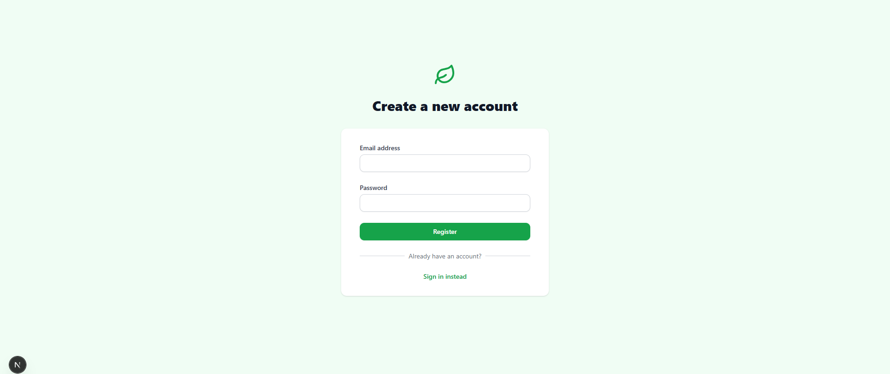
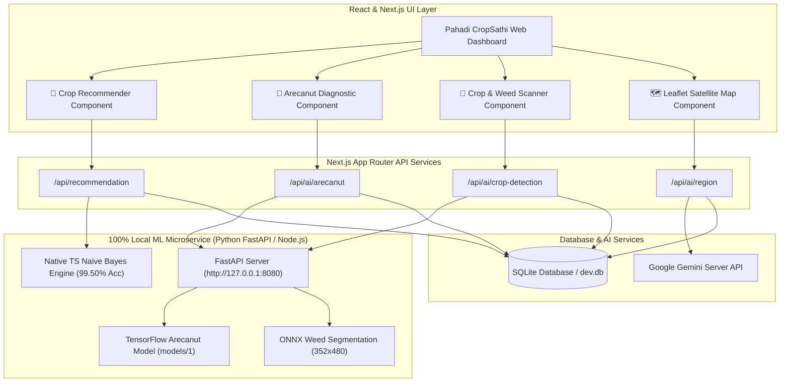
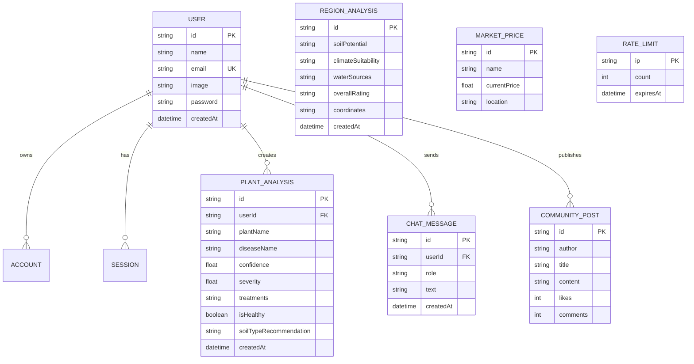

<div align="center">
  
  <h1 align="center">🌾 Pahadi CropSathi (Agri AI)</h1>
  <p align="center">
    <strong>An Intelligent, Multi-Lingual Agricultural Intelligence & Machine Learning Platform</strong><br>
    Powered by Next.js, TensorFlow ML Models, ONNX Runtime, Google Gemini, and Prisma
  </p>

  <div>
    
    
    
    
    
  </div>
</div>

---

## 🌟 About The Project

**Pahadi CropSathi** is an advanced agricultural intelligence platform built for mountain and field farmers. It combines offline machine learning neural networks, computer vision, geospatial mapping, and generative AI to provide real-time crop recommendations, disease diagnostics, and weed density analysis.

---

## 📸 Application Screenshots

<div align="center">
  
  
  <br><br>
  
  
  <br><br>
  
  
</div>

---

## 📐 System Architecture



---

## 🗄️ Database ER Diagram (Prisma + SQLite)



---

## ✨ Integrated Machine Learning Modules & Accuracy

| Module Name | Model Architecture | Accuracy / Performance | Execution Mode |
| :--- | :--- | :--- | :--- |
| **🌱 ML Crop Recommender** | Gaussian Naive Bayes Classifier (`lib/cropRecommender.ts`) | **99.50% Test Accuracy** (2,189 / 2,200 dataset samples) | **100% In-Memory Local TypeScript** |
| **🌴 Arecanut Palm Disease Diagnostic** | TensorFlow Neural Network (`arecanut-detector/models/1`) | **Multi-Class Disease Diagnosis** (Fruit Rot / Koleroga, Stem Bleeding, Healthy) | **100% Offline Python Microservice** |
| **🌾 Field Crop & Weed Density Detector** | ONNX Semantic Segmentation (`lib/crop_weed_model.onnx`) | **Canopy Ratio & ExG Index** (Crop % vs Weed % vs Soil %) | **100% Offline Python Microservice** |
| **🔬 AI Plant Health Scanner** | Multimodal Vision AI (`lib/geminiServer.ts`) | **Comprehensive Diagnostics & Treatment Plans** | **Server API Endpoint** |

---

## 🌴 Directory Tree Structure

```
Pahadi-CropSathi/
├── app/                        # Next.js App Router (Pages & API Routes)
│   ├── api/
│   │   ├── ai/
│   │   │   ├── analyse/        # Plant Health Gemini Scanner
│   │   │   ├── arecanut/       # Arecanut Local Model Proxy
│   │   │   ├── crop-detection/ # Field Crop & Weed Local Model Proxy
│   │   │   └── region/         # Regional Analysis Endpoint
│   │   ├── auth/               # JWT Registration & Login Routes
│   │   └── recommendation/     # ML Crop Recommendation Endpoint
│   ├── layout.tsx              # Root Layout with Navigation & Footer
│   └── page.tsx                # Main Agricultural Intelligence Dashboard
├── assest/                     # Application Interface Screenshots & Assets
├── components/                 # Reusable React Components
│   ├── ArecanutDiagnostic.tsx  # Arecanut Palm Disease Diagnostic UI
│   ├── CropDetectionScanner.tsx# Field Crop & Weed Density Scanner UI
│   ├── CropRecommender.tsx     # ML Crop Recommendation UI
│   ├── ChatBot.tsx             # Interactive AgriBot Assistant
│   ├── LocationPanel.tsx       # Leaflet Satellite Map Component
│   └── Navbar.tsx              # Navigation & Language Switcher
├── lib/                        # Machine Learning Models & Utils
│   ├── arecanutData.ts         # Arecanut Disease Knowledge Database
│   ├── cropRecommender.ts      # Native TS Gaussian Naive Bayes Engine
│   ├── crop_model.json         # Precomputed Naive Bayes Parameters
│   ├── crop_weed_model.onnx    # Converted ONNX Model (352x480)
│   ├── geminiServer.ts         # Google Gemini Server AI Service
│   ├── prisma.ts               # Prisma ORM Singleton Instance
│   └── rate-limit.ts           # IP Rate Limiting Service
├── scripts/                    # Offline ML Microservice
│   ├── local_inference_server.py # FastAPI Server (Port 8080)
│   └── evaluate_nb_pure.py     # Accuracy Evaluation Script (99.50%)
├── crop-recommender/           # Crop Dataset & Model Artifacts
│   ├── Crop_recommendation.csv # 2,200 Agricultural Soil/Weather Samples
│   └── model.pkl               # Python Pickle Model Binary
├── arecanut-detector/          # Trained TensorFlow Model
│   └── models/1/               # SavedModel Directory (saved_model.pb)
├── crop-detection/             # Trained Neural Network
│   └── models/                 # Model Checkpoint (model_352x480_3_30.hd5)
├── prisma/                     # Database Configuration
│   ├── dev.db                  # Local SQLite Database
│   └── schema.prisma           # Prisma Data Schema
├── README.md                   # Comprehensive Project Documentation
└── package.json                # Project Dependencies & Scripts
```

---

## 🛠️ Setup and Installation

### Prerequisites
- [Node.js](https://nodejs.org/en/) (v18 or higher)
- [Python 3.10+](https://www.python.org/) with `pip`

### 1. Clone the repository
```bash
git clone https://github.com/ankush850/Pahadi-CropSathi.git
cd Pahadi-CropSathi
```

### 2. Install Node.js Dependencies
```bash
npm install
```

### 3. Install Python Machine Learning Dependencies
```bash
pip install fastapi uvicorn onnxruntime tensorflow pillow numpy
```

### 4. Environment Configuration
Create a `.env` file in the root directory:
```env
GEMINI_API_KEY=your_gemini_api_key_here
DATABASE_URL="file:./dev.db"
JWT_SECRET="your_secure_random_secret"
GITHUB_ID="your_github_oauth_id"
GITHUB_SECRET="your_github_oauth_secret"
```

### 5. Initialize Database
```bash
npx prisma db push
npx prisma generate
```

### 6. Start the Local ML Microservice (Terminal 1)
```bash
python scripts/local_inference_server.py
```
*(Runs 100% offline on `http://127.0.0.1:8080` for local model predictions)*

### 7. Start the Next.js Web Application (Terminal 2)
```bash
npm run dev
```

Open `http://localhost:3000` in your web browser!

---

## 📄 License & Author

**Author:** Ankush Singh Rawat ([ankush850](https://github.com/ankush850))  
**Email:** ankushsinghrawat154@gmail.com

Developed and maintained by Ankush Singh Rawat. All rights reserved.
